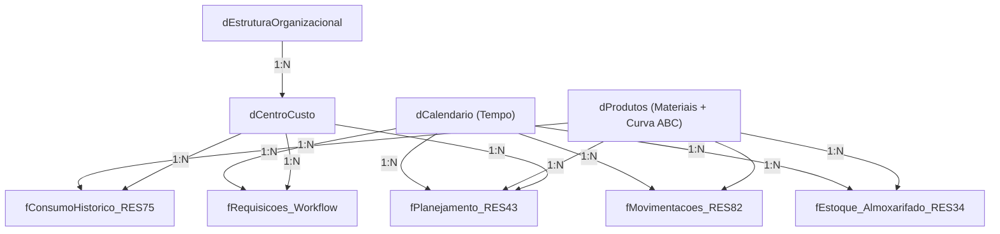

[MVP.md](https://github.com/user-attachments/files/32442958/MVP.md)

# 🚀 MVP — SPRINT 1: PIPELINE DE DADOS E MODELO ANALÍTICO CPTM

> **Projeto:** Business Intelligence para Gestão de Estoque e Suprimentos — CPTM (ERP ALVO)  
> **Etapa:** Sprint 1 — Tratamento de Dados e Dashboard Inicial  
> **Organização Estudada:** Companhia Paulista de Trens Metropolitanos (CPTM)

---

## 📌 1. O que é este MVP

Esta é a primeira entrega funcional do projeto: um pipeline de dados 100% automatizado em Python que extrai, limpa e organiza os relatórios brutos do ERP ALVO da CPTM, transformando-os em um modelo de dados pronto para análise no Power BI. Este MVP já entrega valor de ponta a ponta — dados confiáveis, chaves de ligação padronizadas e um modelo Star Schema funcional — mesmo antes das camadas mais avançadas (alertas, previsões e Curva ABC completa) previstas para as próximas sprints.

---

## 🎯 2. Objetivo do Projeto

Desenvolver um pipeline automatizado de dados e um modelo de Business Intelligence para controle de estoque, consumo histórico, reposição e fluxo de aprovações do ERP ALVO da CPTM, com os seguintes objetivos específicos:

1. Extrair, tratar e consolidar dados brutos de múltiplos relatórios do ERP ALVO.
2. Implementar a classificação de Pareto (Curva ABC) diretamente no pipeline de ETL.
3. Garantir integridade referencial entre tabelas dimensão e fato em formato Star Schema.
4. Exportar os dados tratados em formato otimizado Apache Parquet.
5. Entregar painéis analíticos interativos no Power BI para suporte à decisão logística.

---

## 📂 3. Estrutura do Repositório

```text
CPTM/
├── 01_Bases_ERP/
│   ├── Dimensoes/                # Arquivos brutos de Dimensões (Produtos, CC, Estrutura)
│   ├── Fatos/                    # Arquivos brutos de Fatos (RES34, RES43, RES75, RES82, Workflow)
│   └── Processados_PowerBI/      # Arquivos limpos e tratados (CSV e PARQUET) prontos para o Power BI
├── 02_Documentacao/              # Documentação acadêmica e técnica oficial
├── 03_Modelos_PBIX/              # Arquivo de projeto do Power BI (.pbix)
├── etl_cptm_powerbi.py           # Script principal de ETL em Python (Pandas/PyArrow/Calamine)
└── STATUS.md                     # Registro do status e progresso do projeto
```

---

## 📊 4. Coleta e Descrição das Bases de Dados

Os dados foram extraídos diretamente dos relatórios operacionais do ERP ALVO da CPTM e organizados em duas categorias: **Dimensões** (cadastros) e **Fatos** (transações).

### A. Tabelas de Dimensão (Cadastros)

| Tabela | Descrição | Volume | Atributos Principais |
| :--- | :--- | :--- | :--- |
| `dProdutos` | Catálogo geral de materiais da CPTM | 56.830 produtos | Código Reduzido, Código Estruturado, Descrição, Unidade de Medida, Classe, Grupo, Subgrupo, Preço Médio |
| `dCentroCusto` | Unidades organizacionais requisitantes/consumidoras | 5.840 centros de custo | Código Estruturado (`1.10.00.0.0`), Sigla, Descrição, Status (Ativo/Inativo) |
| `dEstruturaOrganizacional` | Hierarquia corporativa da CPTM | 159 siglas ativas | Sigla, Diretoria, Gerência, Departamento, Linha Ferroviária |
| `dCalendario` | Dimensão temporal (gerada via script) | 6.209 dias (2014–2030) | Data, Ano, Mês, Trimestre, Semestre, Dia da Semana, Flag Dia Útil/Fim de Semana |

### B. Tabelas de Fato (Transações)

| Tabela | Relatório de Origem | Descrição | Volume (Parquet) |
| :--- | :--- | :--- | :--- |
| `fConsumoHistorico_RES75` | RES75 | Histórico de consumo (2014–2026) e PCA (Pesquisa de Consumo Anual) | 2,6 MB |
| `fEstoque_Almoxarifado_RES34` | RES34 | Fotografia de saldos físicos e financeiros em estoque | 801 KB |
| `fMovimentacoes_RES82` | RES82 | Entradas, saídas, devoluções e transferências entre almoxarifados | 3,9 MB |
| `fPlanejamento_RES43` | RES43 | Planejamento de reposição (Normal, Essencial, Estratégico) | 129 KB |
| `fRequisicoes_Workflow` | Workflow | Fluxo de aprovação de requisições de compra (SLA) | 4,8 MB |

---

## 🏗️ 5. Arquitetura do Modelo de Dados — Star Schema

O modelo adota o **Star Schema (Esquema em Estrela)**, padrão da indústria para Data Warehouse e BI: tabelas de **Dimensão** (contexto — "quem, o quê, quando, onde") no topo, filtrando tabelas de **Fato** (eventos numéricos — quantidade, valor, SLA) na base.



**Por que este modelo é vantajoso no Power BI (motor VertiPaq):**
- **Compressão colunar otimizada**: dimensões pequenas + fatos ordenados comprimem com eficiência de até 90%.
- **Contexto de filtro limpo**: a propagação ocorre só no sentido Dimensão ➔ Fato, sem necessidade de relacionamentos bidirecionais.
- **Zero ambiguidade**: dimensões desduplicadas eliminam relacionamentos N:N e contagens duplicadas.

---

## 🔑 6. Chaves Sintéticas de Ligação (`ID_*`)

Para que o Power BI detecte os relacionamentos 1:N automaticamente, o ETL cria e padroniza 5 chaves, sempre posicionadas nas primeiras colunas de cada tabela:

| Chave | Origem (Dimensão) | Fatos Conectados | Formato |
| :--- | :--- | :--- | :--- |
| `ID_Produto_Reduzido` | `dProdutos` | RES75, RES34, RES43 | String numérica 6 dígitos (`'084467'`) |
| `ID_Produto_Estruturado` | `dProdutos` | RES82 | Código hierárquico (`'01.02.003'`) |
| `ID_Centro_Custo` | `dCentroCusto` | RES75, Workflow, RES43 | Texto mascarado (`'1.10.00.0.0'`) |
| `ID_Sigla_CC` | `dEstruturaOrganizacional` | `dCentroCusto` | Sigla padronizada (`'GOM'`) |
| `ID_Data` | `dCalendario` | RES82, RES34, Workflow, RES43 | ISO `YYYY-MM-DD` |

### Matriz completa de relacionamentos

| Dimensão | Chave | Fato/Destino | Cardinalidade | Função |
| :--- | :--- | :--- | :--- | :--- |
| `dProdutos` | `ID_Produto_Reduzido` | `fPlanejamento_RES43` | 1:N | Filtrar planejamento por produto/curva ABC |
| `dProdutos` | `ID_Produto_Reduzido` | `fEstoque_Almoxarifado_RES34` | 1:N | Filtrar saldos, valores e almoxarifados |
| `dProdutos` | `ID_Produto_Reduzido` | `fConsumoHistorico_RES75` | 1:N | Histórico de consumo por produto |
| `dProdutos` | `ID_Produto_Estruturado` | `fMovimentacoes_RES82` | 1:N | Rastrear entradas, saídas e transferências |
| `dEstruturaOrganizacional` | `ID_Sigla_CC` | `dCentroCusto` | 1:N | Agrupar centros de custo por hierarquia |
| `dCentroCusto` | `ID_Centro_Custo` | `fConsumoHistorico_RES75` | 1:N | Consumo realizado vs. planejado por unidade |
| `dCentroCusto` | `ID_Centro_Custo` | `fRequisicoes_Workflow` | 1:N | SLA e volume de requisições por unidade |
| `dCalendario` | `ID_Data` | Todos os Fatos | 1:N | Filtrar por ano, mês ou período |

---

## 🛠️ 7. Pipeline de ETL em Python (`etl_cptm_powerbi.py`)

O script consolida, limpa e exporta todas as tabelas com bibliotecas **Pandas**, **PyArrow** e a engine Rust **Calamine**. Principais etapas:

### 7.1. Leitura acelerada com a engine Rust `calamine`

Os relatórios do ERP ALVO chegam apenas em Excel (`.xlsx`/`.xls`/`.xlsm`). A engine padrão do Pandas (`openpyxl`) é lenta em arquivos grandes; a engine `calamine` (escrita em Rust) leu o pipeline completo (9 tabelas) em **~18,5 segundos**, contra **~4min45s** do `openpyxl` — um ganho de **~15x**:

```python
def processar_dimensao_produtos() -> pd.DataFrame:
    """Lê os arquivos Excel da dProdutos com a engine Rust 'calamine'."""
    df = pd.read_excel(
        caminho_arquivo,
        engine='calamine',  # Engine Rust de alta performance
        dtype=str            # Preserva zeros à esquerda e formato de código
    )
    df.columns = [str(col).strip() for col in df.columns]
    return df
```

| Base | Tamanho | `openpyxl` | `calamine` | Ganho |
| :--- | :--- | :--- | :--- | :--- |
| `dProdutos` (56.830 lin x 138 col) | ~18 MB | 44,5 s | 2,9 s | ~15,3x |
| `fConsumoHistorico_RES75` | ~24 MB | 68,2 s | 5,1 s | ~13,4x |
| `fMovimentacoes_RES82` | ~30 MB | 52,0 s | 4,2 s | ~12,4x |
| `fRequisicoes_Workflow` | ~26 MB | 41,8 s | 3,4 s | ~12,3x |
| **Total (9 tabelas)** | — | **~4min45s** | **~18,5s** | **~15,4x** |

### 7.2. Limpeza e padronização de chaves

- Remoção de quebras de linha (`\n`, `\r`), tabulações e espaços duplos.
- Preservação estrita de zeros à esquerda em códigos de produto (`'000033'`, `'084467'`) e alfanuméricos (`'E006054'`).
- Resolução da máscara de texto com pontos do `dCentroCusto` (`'1.10.00.0.0'`), evitando conversão indevida para número no Power Query.
- Criação e reordenação automática das colunas `ID_*` para as primeiras posições de cada tabela:

```python
def reordenar_colunas_id(df: pd.DataFrame) -> pd.DataFrame:
    """Coloca todas as colunas 'ID_*' nas primeiras posições da tabela."""
    colunas_id = [col for col in df.columns if col.startswith("ID_")]
    outras_colunas = [col for col in df.columns if not col.startswith("ID_")]
    return df[colunas_id + outras_colunas]
```

### 7.3. Unpivot (`pd.melt`) da tabela de consumo `fConsumoHistorico_RES75`

O RES75 chega em formato matricial (uma coluna por ano/indicador: `2014 MOV`, `2014 PCA`, ..., `2026 PCA`), incompatível com o Star Schema e com medidas DAX dinâmicas. O `pd.melt()` transforma essas colunas em linhas:

```python
df_unpivoted = pd.melt(
    df_reduzido,
    id_vars=colunas_id,
    value_vars=colunas_anos,
    var_name="Ano_Tipo",
    value_name="Quantidade"
)

# Separa Ano e Tipo de Indicador (MOV = realizado, PCA = planejado)
df_unpivoted['Ano'] = df_unpivoted['Ano_Tipo'].apply(lambda x: x.split()[0])
df_unpivoted['Tipo_Indicador'] = df_unpivoted['Ano_Tipo'].apply(lambda x: x.split()[1])
df_unpivoted.drop(columns=['Ano_Tipo'], inplace=True)

# Remove linhas sem consumo real, reduzindo o volume em mais de 70%
df_unpivoted = df_unpivoted[
    (df_unpivoted["ID_Produto_Reduzido"] != "") & (df_unpivoted["Quantidade"] > 0)
]
```

Resultado (formato longo, pronto para o Power BI):

| ID_Produto_Reduzido | ID_Centro_Custo | Ano | Tipo_Indicador | Quantidade |
| :--- | :--- | :--- | :--- | :--- |
| `084467` | `1.10.00.0.0` | `2014` | `MOV` | 150.0 |
| `084467` | `1.10.00.0.0` | `2014` | `PCA` | 180.0 |

Esse formato viabiliza medidas DAX diretas, como:

```dax
Consumo_Realizado_Qtd = 
CALCULATE(
    SUM(fConsumoHistorico_RES75[Quantidade]),
    fConsumoHistorico_RES75[Tipo_Indicador] = "MOV"
)

Pct_Aderencia_PCA = DIVIDE([Consumo_Realizado_Qtd], [Consumo_Planejado_PCA], 0)
```

### 7.4. Classificação de Pareto (Curva ABC) injetada no ETL

O cálculo da Curva ABC é feito em Python (e não em DAX), a partir do consumo total agrupado por produto em `fConsumoHistorico_RES75`, e injetado como novos atributos em `dProdutos`:

```python
def enriquecer_dprodutos_curva_abc(df_produtos, df_consumo) -> pd.DataFrame:
    """Calcula a Curva ABC (Classe A/B/C ou Sem Consumo) e enriquece dProdutos."""
    abc = df_consumo.groupby("ID_Produto_Reduzido")["Quantidade"].sum().reset_index()
    abc = abc[abc["Quantidade"] > 0].sort_values(by="Quantidade", ascending=False)

    total_consumo = abc["Quantidade"].sum()
    abc["Pct_Consumo_Acumulado"] = (abc["Quantidade"] / total_consumo).cumsum()
    abc["Rank_Consumo"] = range(1, len(abc) + 1)

    def classificar_abc(pct):
        if pct <= 0.80:
            return "Classe A"
        elif pct <= 0.95:
            return "Classe B"
        else:
            return "Classe C"

    abc["Classe_ABC"] = abc["Pct_Consumo_Acumulado"].apply(classificar_abc)
    return df_produtos.merge(abc, on="ID_Produto_Reduzido", how="left")
```

Novos atributos gerados em `dProdutos`: `Classe_ABC`, `Rank_Consumo`, `Quantidade_Consumida_Total`, `Pct_Consumo_Acumulado`.

### 7.5. Exportação dual (CSV + Parquet)

Cada tabela tratada é exportada em dois formatos:

```python
df_resultado.to_csv(caminho_csv, index=False, sep=";", encoding="utf-8-sig")
df_resultado.to_parquet(caminho_parquet, index=False)
```

**Por que Apache Parquet:**
- Preserva rigorosamente tipos e máscaras de texto (evita o Power Query "corrigir" `1.10.00.0.0` para número).
- Carrega esquema binário direto na memória — sem parser de texto como o CSV.
- Até **10x mais rápido** para carregar no Power BI Desktop e até **85% menor** em disco (ex.: `dProdutos` cai de 42,6 MB em CSV para 7,4 MB em Parquet).

---

## ✅ 8. Conclusões dos Tratamentos

### A. Integridade Referencial (Match entre Dimensões e Fatos)

| Dimensão → Fato | % de Match |
| :--- | :--- |
| `dProdutos` → `fPlanejamento_RES43` | 100,0% |
| `dProdutos` → `fEstoque_Almoxarifado_RES34` | 100,0% |
| `dProdutos` → `fConsumoHistorico_RES75` | 100,0% |
| `dProdutos` → `fMovimentacoes_RES82` | 99,1% |
| `dCentroCusto` → `fConsumoHistorico_RES75` / `fRequisicoes_Workflow` | 100,0% |
| `dEstruturaOrganizacional` → `dCentroCusto` | 100,0% |
| `dCalendario` → todos os Fatos | 99,9% a 100,0% |

### B. Resultado da Classificação de Pareto (Curva ABC)

| Classe | Produtos | % do Consumo Acumulado |
| :--- | :--- | :--- |
| 🟢 Classe A | 28 produtos | 80% |
| 🟡 Classe B | 452 produtos | 15% seguintes |
| 🔴 Classe C | 14.146 produtos | 5% finais |
| ⚪ Sem Consumo | 42.204 produtos (74,3% do catálogo) | Sem giro recente |

> **Conclusão prática:** a CPTM possui um volume expressivo de itens cadastrados sem giro recente, o que evidencia oportunidade imediata de racionalização de estoque e identificação de obsolescência.

---

## 📈 9. Resultados Esperados (Dashboard Power BI)

1. **Modelo Star Schema** puro, com relacionamentos 1:N ativados automaticamente via chaves `ID_*` (`03_Modelos_PBIX/CPTM.pbix`).
2. **Biblioteca de medidas DAX**: Giro de Estoque, Cobertura em Meses, Estoque Valorizado, Consumo Médio Mensal, Aderência PCA, Tempo Médio de Aprovação (SLA).
3. **Painéis planejados**:
   - Visão Executiva de Estoque e Valorização.
   - Análise de Consumo Histórico e Curva ABC (foco nos 28 itens Classe A).
   - Gestão de Reposição e Workflow de Solicitações (SLA por unidade).

---

## 🏁 10. Status Atual e Próximos Passos

Este MVP cobre a fundação de dados da **Sprint 1**: coleta, tratamento, modelagem Star Schema e cálculo da Curva ABC. As próximas sprints incluem:

- **Sprint 2:** alertas de estoque parado/ruptura, análises preditivas de consumo, cobertura em dias, indicadores de eficiência logística.
- **Sprint 3:** documentação técnica final do modelo para integração corporativa e dashboard gerencial consolidado com KPIs estratégicos.
